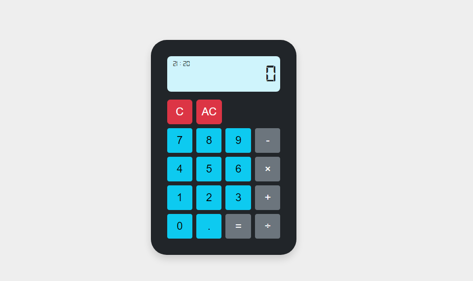

# Kalkulator Sederhana dengan JavaScript dan Bootstrap

Aplikasi kalkulator sederhana yang dibuat menggunakan JavaScript dan Bootstrap. Aplikasi ini mendukung operasi aritmatika dasar seperti penjumlahan, pengurangan, perkalian, dan pembagian.

## Fitur

- **Operasi Aritmatika Dasar**: Penjumlahan, pengurangan, perkalian, dan pembagian.
- **Pemisah Ribuan**: Otomatis menambahkan titik (.) sebagai pemisah ribuan.
- **Desain Responsif**: Menggunakan Bootstrap untuk tampilan yang responsif.
- **Clear All dan Backspace**: Tombol `AC` untuk mereset kalkulator dan tombol `C` untuk menghapus digit terakhir.

## Instalasi

Untuk menjalankan proyek ini di lokal Anda, ikuti langkah-langkah berikut:

1. **Clone repository ini**:
   ```bash
   git clone https://github.com/rahmathidaya13/calculator.git
2. **Masuk ke direktori proyek**:
   ```bash
   cd calculator
3. **Buka file index.html**:
   ```bash
   Jalankan file index.html di browser Anda dengan mengklik dua kali atau gunakan live server jika menggunakan editor kode.
   
## Image

